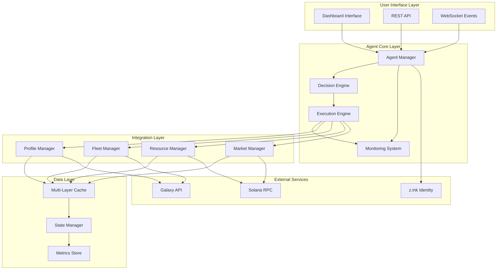

# S.T.R.I.K.E. Technical Architecture

*Deep dive into gaming agent infrastructure design and implementation*

## Overview

**S.T.R.I.K.E.** represents a fundamentally different approach to blockchain automation compared to traditional trading bots. While trading bots optimize for simple token swaps, gaming agents must coordinate complex multi-program interactions across dynamic game state.

This document details the technical architecture that enables autonomous operation in production gaming economies.

---

## 1. System Architecture

### 1.1 High-Level Design



### 1.2 Core Components

#### Agent Manager
- **Purpose**: Central coordination and lifecycle management
- **Responsibilities**: Agent state, strategy execution, error recovery
- **Technologies**: Event-driven architecture, state machines

#### Decision Engine  
- **Purpose**: Strategic decision making and optimization
- **Responsibilities**: Game state analysis, action selection, risk assessment
- **Technologies**: Rule-based systems, machine learning models

#### Execution Engine
- **Purpose**: Transaction coordination and program interaction
- **Responsibilities**: Multi-program transactions, error handling, retry logic
- **Technologies**: Solana Web3.js, custom transaction builders

---

## 2. Gaming vs Trading Architecture

### 2.1 Complexity Comparison

| Aspect | Trading Bots | Gaming Agents (S.T.R.I.K.E.) |
|--------|--------------|-------------------------------|
| **Account Types** | 2-5 (wallet, token accounts) | 50+ (profiles, fleets, ships, resources) |
| **Program Coordination** | 1-2 programs | 5+ programs simultaneously |
| **State Management** | Simple price feeds | Complex game state trees |
| **Transaction Patterns** | Linear (buy/sell) | Interdependent workflows |
| **Error Recovery** | Retry failed swaps | Complex state rollback |
| **Data Sources** | Price oracles | Real-time game APIs |
| **Decision Complexity** | Price optimization | Multi-objective strategy |

### 2.2 Technical Challenges

**Trading Bot Challenges**:
- Price feed accuracy
- Slippage management
- MEV protection
- Liquidity optimization

**Gaming Agent Challenges**:
- Multi-program state synchronization
- Complex account relationship management
- Dynamic game rule interpretation
- Long-term strategic planning
- Real-time adaptation to game events
- Player preference integration

---

## 3. Multi-Program Coordination

### 3.1 Solana Program Integration

S.T.R.I.K.E. coordinates with multiple Solana programs simultaneously:

```javascript
const PROGRAMS = {
  SAGE2: {
    programId: 'SAGEqqFewepDHH6hMDcmWy7yjHPpyKLDnRXKb3Ki8e6',
    purpose: 'Fleet operations and ship management',
    accounts: ['Fleet', 'Ship', 'FleetShips', 'MineItem', 'SectorFleet']
  },
  
  PPROFLEX: {
    programId: 'pprofELXqDsLG969Ak72A7weUQ51AaYoZgvPzzJBRH8',
    purpose: 'Player profiles and season management', 
    accounts: ['Profile', 'ProfileFaction', 'XpCategory']
  },
  
  CARGO: {
    programId: 'Cargo2VNvQEp5cC7C6GrVZXfbxWh9wBh6tKNusgHLnCTB',
    purpose: 'Resource and inventory management',
    accounts: ['CargoHold', 'CargoStats', 'CargoType']
  },
  
  GALACTIC_MARKETPLACE: {
    programId: 'traderDnaR5w6Tcoi3NFm53i48FTDNbGjBSZwWXDRrg',
    purpose: 'Trading and market operations',
    accounts: ['Order', 'Currency', 'OpenOrdersAccount']
  }
};
```

### 3.2 Account Relationship Mapping

```javascript
class AccountRelationshipManager {
  constructor() {
    this.relationships = new Map();
    this.cache = new LRUCache(1000);
  }
  
  async mapPlayerAccounts(walletPubkey) {
    const accountTree = {
      wallet: walletPubkey,
      profiles: [],
      fleets: [],
      ships: [],
      resources: [],
      orders: []
    };
    
    // 1. Find all player profiles across seasons
    const profiles = await this.findPlayerProfiles(walletPubkey);
    accountTree.profiles = profiles;
    
    // 2. For each profile, find fleets
    for (const profile of profiles) {
      const fleets = await this.findProfileFleets(profile.pubkey);
      accountTree.fleets.push(...fleets);
      
      // 3. For each fleet, find ships and resources
      for (const fleet of fleets) {
        const ships = await this.findFleetShips(fleet.pubkey);
        const resources = await this.findFleetResources(fleet.pubkey);
        
        accountTree.ships.push(...ships);
        accountTree.resources.push(...resources);
      }
    }
    
    // 4. Find active market orders
    const orders = await this.findPlayerOrders(walletPubkey);
    accountTree.orders = orders;
    
    return accountTree;
  }
}
```

---

## 4. Performance Optimization

### 4.1 RPC Optimization

**Challenge**: Managing 200+ account reads per operation within RPC rate limits.

**Solution**: Intelligent batching and caching strategy.

```javascript
class RPCOptimizer {
  constructor(rpcUrl, opts = {}) {
    this.connection = new Connection(rpcUrl, opts.commitment || 'confirmed');
    this.batchSize = opts.batchSize || 50;
    this.cache = new LRUCache(5000);
    this.rateLimiter = new RateLimiter(100, 1000); // 100 req/sec
  }
  
  async batchGetMultipleAccounts(pubkeys) {
    // Group requests into optimal batch sizes
    const batches = this.createBatches(pubkeys, this.batchSize);
    const results = [];
    
    for (const batch of batches) {
      await this.rateLimiter.acquire();
      
      try {
        const accountInfos = await this.connection.getMultipleAccountsInfo(
          batch,
          { commitment: 'confirmed' }
        );
        results.push(...accountInfos);
        
        // Cache successful results
        batch.forEach((pubkey, index) => {
          if (accountInfos[index]) {
            this.cache.set(pubkey.toString(), accountInfos[index]);
          }
        });
        
      } catch (error) {
        console.error('Batch request failed:', error);
        
        // Fallback to individual requests
        for (const pubkey of batch) {
          const accountInfo = await this.getSingleAccount(pubkey);
          results.push(accountInfo);
        }
      }
    }
    
    return results;
  }
}
```

### 4.2 Multi-Layer Caching

```javascript
class CacheHierarchy {
  constructor() {
    // L1: In-memory cache (fastest, smallest)
    this.l1Cache = new Map();
    
    // L2: LRU cache (fast, larger)
    this.l2Cache = new LRUCache(10000);
    
    // L3: Persistent cache (slower, persistent)
    this.l3Cache = new PersistentCache('./cache');
  }
  
  async get(key) {
    // Check L1 first
    if (this.l1Cache.has(key)) {
      return this.l1Cache.get(key);
    }
    
    // Check L2
    const l2Value = this.l2Cache.get(key);
    if (l2Value) {
      // Promote to L1
      this.l1Cache.set(key, l2Value);
      return l2Value;
    }
    
    // Check L3
    const l3Value = await this.l3Cache.get(key);
    if (l3Value) {
      // Promote to L2 and L1
      this.l2Cache.set(key, l3Value);
      this.l1Cache.set(key, l3Value);
      return l3Value;
    }
    
    return null;
  }
  
  async set(key, value, ttl = 300) {
    // Store in all layers
    this.l1Cache.set(key, value);
    this.l2Cache.set(key, value);
    await this.l3Cache.set(key, value, ttl);
  }
}
```

---

## 5. Decision Engine

### 5.1 Strategy Framework

```javascript
class DecisionEngine {
  constructor(config) {
    this.strategies = new Map();
    this.riskProfile = config.riskProfile || 'moderate';
    this.objectives = config.objectives || ['efficiency', 'profit', 'safety'];
    this.constraints = config.constraints || {};
  }
  
  async analyzeGameState(accountTree) {
    const analysis = {
      fleets: await this.analyzeFleets(accountTree.fleets),
      resources: await this.analyzeResources(accountTree.resources),
      market: await this.analyzeMarket(accountTree.orders),
      opportunities: []
    };
    
    // Identify optimization opportunities
    analysis.opportunities = await this.identifyOpportunities(analysis);
    
    return analysis;
  }
  
  async generateActionPlan(analysis) {
    const actionPlan = {
      immediate: [],    // Actions to take now
      scheduled: [],    // Actions to schedule for later
      conditional: []   // Actions dependent on game state changes
    };
    
    for (const opportunity of analysis.opportunities) {
      const actions = await this.evaluateOpportunity(opportunity);
      
      // Categorize actions by timing and dependencies
      for (const action of actions) {
        if (action.priority === 'immediate') {
          actionPlan.immediate.push(action);
        } else if (action.timing) {
          actionPlan.scheduled.push(action);
        } else {
          actionPlan.conditional.push(action);
        }
      }
    }
    
    return actionPlan;
  }
}
```

### 5.2 Multi-Objective Optimization

S.T.R.I.K.E. balances multiple objectives simultaneously:

```javascript
class ObjectiveOptimizer {
  constructor(objectives, weights) {
    this.objectives = objectives;
    this.weights = weights || this.defaultWeights();
  }
  
  async optimizeFleetComposition(ships, constraints) {
    const objectives = {
      efficiency: (composition) => this.calculateEfficiency(composition),
      profitability: (composition) => this.calculateProfitability(composition),
      safety: (composition) => this.calculateSafety(composition),
      flexibility: (composition) => this.calculateFlexibility(composition)
    };
    
    // Use genetic algorithm for multi-objective optimization
    const optimizer = new GeneticOptimizer({
      populationSize: 100,
      generations: 50,
      objectives: objectives,
      constraints: constraints
    });
    
    return await optimizer.optimize(ships);
  }
}
```

---

## 6. Error Handling & Recovery

### 6.1 Transaction Error Recovery

Gaming operations require sophisticated error recovery due to complex state dependencies:

```javascript
class TransactionRecoveryManager {
  constructor() {
    this.recoveryStrategies = new Map();
    this.setupRecoveryStrategies();
  }
  
  setupRecoveryStrategies() {
    // Fleet operation failed
    this.recoveryStrategies.set('fleet_operation_failed', async (error, context) => {
      // 1. Check if fleet state changed during operation
      const currentFleetState = await this.getFleetState(context.fleetId);
      
      if (currentFleetState.status !== context.expectedStatus) {
        // Fleet state changed, recalculate optimal action
        return await this.recalculateFleetAction(context.fleetId);
      }
      
      // 2. Check if resources are available
      const resources = await this.getFleetResources(context.fleetId);
      if (resources.fuel < context.requiredFuel) {
        // Need to refuel first
        return await this.createRefuelOperation(context.fleetId);
      }
      
      // 3. Retry with updated parameters
      return await this.retryWithBackoff(context.operation, context.attempt + 1);
    });
    
    // Market order failed
    this.recoveryStrategies.set('market_order_failed', async (error, context) => {
      // Check if market conditions changed
      const currentPrice = await this.getCurrentPrice(context.item);
      
      if (Math.abs(currentPrice - context.expectedPrice) > context.slippageTolerance) {
        // Price moved too much, recalculate order
        return await this.createUpdatedOrder(context, currentPrice);
      }
      
      return await this.retryWithBackoff(context.operation, context.attempt + 1);
    });
  }
  
  async handleTransactionError(error, context) {
    const strategy = this.recoveryStrategies.get(context.operationType);
    
    if (strategy) {
      return await strategy(error, context);
    }
    
    // Default recovery: exponential backoff retry
    return await this.defaultRecovery(error, context);
  }
}
```

### 6.2 State Synchronization

```javascript
class StateSynchronizer {
  constructor() {
    this.stateVersion = 0;
    this.pendingUpdates = new Map();
    this.syncInterval = 30000; // 30 seconds
  }
  
  async syncGameState() {
    try {
      // 1. Fetch latest state from all sources
      const [galaxyState, solanaState, zinkState] = await Promise.all([
        this.fetchGalaxyState(),
        this.fetchSolanaState(), 
        this.fetchZinkState()
      ]);
      
      // 2. Detect conflicts
      const conflicts = this.detectConflicts(galaxyState, solanaState);
      
      if (conflicts.length > 0) {
        // 3. Resolve conflicts using Solana as source of truth
        await this.resolveConflicts(conflicts, solanaState);
      }
      
      // 4. Update local state
      await this.updateLocalState({
        galaxy: galaxyState,
        solana: solanaState,
        zink: zinkState,
        version: ++this.stateVersion
      });
      
    } catch (error) {
      console.error('State synchronization failed:', error);
      
      // Fallback to cached state with warning
      await this.handleSyncFailure(error);
    }
  }
}
```

---

## 7. Security & Identity

### 7.1 z.ink ZK Identity Integration

```javascript
class ZKIdentityManager {
  constructor(zinkEndpoint) {
    this.zink = new ZinkClient(zinkEndpoint);
    this.proofs = new Map();
  }
  
  async generateAgentProof(agentId, playerWallet) {
    const proof = await this.zink.generateProof({
      agentId: agentId,
      playerWallet: playerWallet.publicKey.toString(),
      timestamp: Date.now(),
      capabilities: [
        'fleet_management',
        'resource_trading', 
        'market_participation'
      ]
    });
    
    this.proofs.set(agentId, proof);
    return proof;
  }
  
  async verifyAgentAction(action, agentId) {
    const proof = this.proofs.get(agentId);
    
    if (!proof) {
      throw new Error('No proof found for agent');
    }
    
    return await this.zink.verifyAction({
      action: action,
      proof: proof,
      timestamp: Date.now()
    });
  }
}
```

### 7.2 Wallet Security

```javascript
class SecureWalletManager {
  constructor(opts = {}) {
    this.encryptionKey = opts.encryptionKey;
    this.derivationPath = opts.derivationPath || "m/44'/501'/0'/0'";
  }
  
  async createAgentWallet(playerWallet) {
    // Derive agent wallet from player wallet
    const seed = await this.deriveAgentSeed(playerWallet);
    const agentWallet = Keypair.fromSeed(seed);
    
    // Store encrypted version
    const encrypted = await this.encryptWallet(agentWallet);
    await this.storeEncryptedWallet(agentWallet.publicKey.toString(), encrypted);
    
    return agentWallet;
  }
  
  async signTransaction(transaction, walletPubkey) {
    // Decrypt wallet
    const encrypted = await this.getEncryptedWallet(walletPubkey);
    const wallet = await this.decryptWallet(encrypted);
    
    // Sign transaction
    transaction.sign(wallet);
    
    // Clear wallet from memory
    wallet.secretKey.fill(0);
    
    return transaction;
  }
}
```

---

## 8. Monitoring & Observability

### 8.1 System Metrics

```javascript
class MetricsCollector {
  constructor() {
    this.metrics = {
      transactions: new Map(),
      performance: new Map(),
      errors: new Map(),
      business: new Map()
    };
    
    this.startMetricsCollection();
  }
  
  recordTransaction(type, duration, success) {
    const key = `${type}_${success ? 'success' : 'failure'}`;
    
    if (!this.metrics.transactions.has(key)) {
      this.metrics.transactions.set(key, {
        count: 0,
        totalDuration: 0,
        avgDuration: 0
      });
    }
    
    const metric = this.metrics.transactions.get(key);
    metric.count++;
    metric.totalDuration += duration;
    metric.avgDuration = metric.totalDuration / metric.count;
  }
  
  recordPerformance(operation, duration, accountCount) {
    this.metrics.performance.set(operation, {
      duration,
      accountCount,
      efficiency: accountCount / duration,
      timestamp: Date.now()
    });
  }
  
  generateReport() {
    return {
      transactions: Object.fromEntries(this.metrics.transactions),
      performance: Object.fromEntries(this.metrics.performance),
      errors: Object.fromEntries(this.metrics.errors),
      business: Object.fromEntries(this.metrics.business),
      timestamp: Date.now()
    };
  }
}
```

### 8.2 Health Monitoring

```javascript
class HealthMonitor {
  constructor() {
    this.checks = new Map();
    this.status = 'healthy';
    this.setupHealthChecks();
  }
  
  setupHealthChecks() {
    // RPC Health
    this.checks.set('rpc_health', async () => {
      const start = Date.now();
      try {
        await connection.getSlot();
        const duration = Date.now() - start;
        
        return {
          status: duration < 2000 ? 'healthy' : 'degraded',
          latency: duration,
          message: `RPC responding in ${duration}ms`
        };
      } catch (error) {
        return {
          status: 'unhealthy',
          error: error.message,
          message: 'RPC connection failed'
        };
      }
    });
    
    // Agent Health  
    this.checks.set('agent_health', async () => {
      const activeAgents = await this.getActiveAgents();
      const healthyAgents = activeAgents.filter(agent => agent.status === 'healthy');
      
      return {
        status: healthyAgents.length === activeAgents.length ? 'healthy' : 'degraded',
        activeAgents: activeAgents.length,
        healthyAgents: healthyAgents.length,
        message: `${healthyAgents.length}/${activeAgents.length} agents healthy`
      };
    });
  }
  
  async runHealthChecks() {
    const results = {};
    
    for (const [name, check] of this.checks) {
      try {
        results[name] = await check();
      } catch (error) {
        results[name] = {
          status: 'unhealthy',
          error: error.message
        };
      }
    }
    
    // Determine overall health
    const statuses = Object.values(results).map(r => r.status);
    this.status = statuses.includes('unhealthy') ? 'unhealthy' :
                 statuses.includes('degraded') ? 'degraded' : 'healthy';
    
    return { status: this.status, checks: results };
  }
}
```

---

## 9. Future Architecture Considerations

### 9.1 Multi-Game Support

```javascript
class GameEngineAbstraction {
  constructor() {
    this.engines = new Map();
  }
  
  registerGame(gameId, config) {
    const engine = {
      id: gameId,
      name: config.name,
      programs: config.programs,
      api: new GameAPI(config.apiEndpoint),
      accountTypes: config.accountTypes,
      operations: config.operations
    };
    
    this.engines.set(gameId, engine);
  }
  
  async executeOperation(gameId, operation) {
    const engine = this.engines.get(gameId);
    
    if (!engine) {
      throw new Error(`Game engine not found: ${gameId}`);
    }
    
    return await engine.operations[operation.type](operation.params);
  }
}
```

### 9.2 Cross-Chain Support

```javascript
class CrossChainBridge {
  constructor() {
    this.chains = new Map();
    this.bridges = new Map();
  }
  
  async bridgeAssets(fromChain, toChain, assets) {
    const bridge = this.getBridge(fromChain, toChain);
    
    if (!bridge) {
      throw new Error(`No bridge available: ${fromChain} -> ${toChain}`);
    }
    
    return await bridge.transfer(assets);
  }
}
```

---

## 10. Conclusion

S.T.R.I.K.E.'s architecture demonstrates that gaming agents require fundamentally different design patterns than trading bots. The complexity of managing multi-program state, coordinating long-term strategies, and handling dynamic game environments necessitates sophisticated infrastructure.

Key architectural innovations:

1. **Multi-Program Coordination**: Seamless integration across 5+ Solana programs
2. **Intelligent Caching**: Multi-layer cache hierarchy for sub-2s response times
3. **Advanced Error Recovery**: Game-aware error handling and state reconciliation  
4. **ZK Identity Integration**: Verifiable agent authenticity and action authorization
5. **Multi-Objective Optimization**: Balancing efficiency, profitability, safety, and flexibility

This architecture provides the foundation for autonomous gaming economies while maintaining the performance, security, and reliability requirements of production blockchain systems.

The future of gaming agents lies not in simple automation, but in intelligent infrastructure that understands the nuanced requirements of complex gaming economies. S.T.R.I.K.E. represents the first step toward that future.

---

## References

- [Solana Web3.js Documentation](https://solana-labs.github.io/solana-web3.js/)
- [Star Atlas SAGE Documentation](https://sage.staratlas.com/docs)  
- [Galaxy API Reference](https://galaxy.staratlas.com/docs)
- [z.ink Platform Documentation](https://docs.z.ink)
- [Agent Design Patterns](https://patterns.agent.xyz)