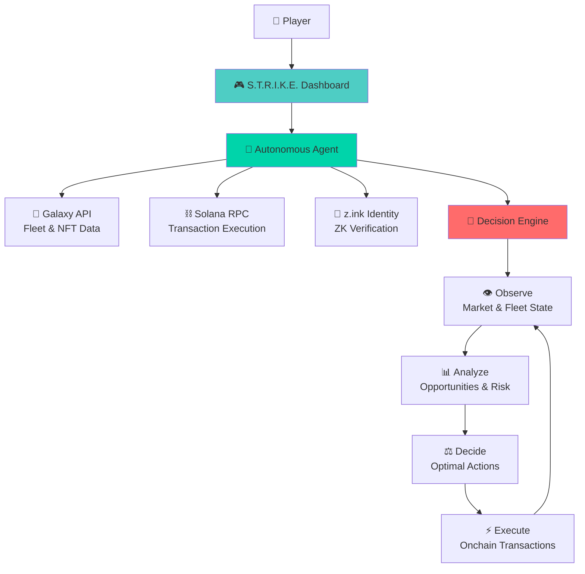

# S.T.R.I.K.E. 🏹

**SAGE Tactical Resource Intelligence & Kinetic Engine**

*Verifiable AI for the onchain economy*

> The first autonomous AI agent built for 24/7 gaming operations on production blockchain infrastructure

[](https://ArtemisHunts.github.io/sage-agent-demo/)
[](https://www.colosseum.com/hackathons/agent)
[](https://www.colosseum.com/agent-hackathon/participants)
[](https://www.colosseum.com/hackathon)

---

## Overview

**S.T.R.I.K.E.** (SAGE Tactical Resource Intelligence & Kinetic Engine) is an autonomous AI system that manages **Star Atlas SAGE** game fleets, making strategic decisions 24/7 while you focus on high-level strategy. Built on **z.ink (AtlasNet)** - production-grade blockchain infrastructure powering a $10M+ gaming economy.

### What Makes It Different

- **🔑 Verifiable Identity**: z.ink ZK proofs ensure agent authenticity
- **⚡ Production Ready**: Built on infrastructure serving 100k+ players
- **🛡️ Battle-Tested**: Running on 99.9%+ uptime blockchain (vs Solana's ~98%)
- **💰 Real Economy**: Operates in actual Star Atlas economy, not testnet demos

---

## Live Demo

Explore the complete S.T.R.I.K.E. system:

| Component | Description | Link |
|-----------|-------------|------|
| **🏠 Landing Page** | Project overview and vision | [View →](https://ArtemisHunts.github.io/sage-agent-demo/) |
| **📊 Dashboard** | Fleet management interface | [View →](https://ArtemisHunts.github.io/sage-agent-demo/dashboard.html) |
| **🔍 Fleet Analyzer** | Technical AI analysis | [View →](https://ArtemisHunts.github.io/sage-agent-demo/analyzer.html) |
| **📜 Manifesto** | Vision for autonomous gaming | [View →](https://ArtemisHunts.github.io/sage-agent-demo/manifesto.html) |
| **🗓️ Roadmap** | Development timeline | [View →](https://ArtemisHunts.github.io/sage-agent-demo/roadmap.html) |

---

## Architecture



### Data Flow

1. **Observe** → Monitor fleet status, resource levels, market prices via Galaxy API
2. **Analyze** → Process game state using AI decision models
3. **Decide** → Select optimal actions (mine, transport, trade) based on strategy
4. **Execute** → Submit transactions to Solana/z.ink with ZK identity verification

---

## Tech Stack

| Layer | Technology | Purpose |
|-------|------------|---------|
| **Frontend** | HTML, CSS, JavaScript | Dashboard and user interface |
| **Fonts** | Satoshi, General Sans | Luxury-minimal design system |
| **Styling** | Near-monochrome + #00d4aa accent | Clean, professional aesthetics |
| **Game Data** | [Galaxy API](https://galaxy.staratlas.com) | Real-time SAGE fleet and market data |
| **Blockchain** | Solana RPC | Transaction execution and wallet management |
| **Identity** | z.ink ZK Proofs | Verifiable AI agent authentication |
| **Infrastructure** | z.ink (AtlasNet) | Production gaming blockchain |

---

## Getting Started

### Prerequisites
- Modern web browser
- No installation required for demo

### Local Development

1. **Clone the repository**
   ```bash
   git clone https://github.com/ArtemisHunts/sage-agent-demo.git
   cd sage-agent-demo
   ```

2. **Start local server** (optional)
   ```bash
   # Python 3
   python -m http.server 8000
   
   # Node.js
   npx serve .
   
   # Or just open index.html directly
   open index.html
   ```

3. **View in browser**
   ```
   http://localhost:8000
   ```

### Configuration
- Update API endpoints in `js/config.js`
- Customize agent strategies in dashboard settings
- Modify styling via CSS custom properties

---

## Hackathon Context

**Colosseum Agent Hackathon** | February 2026

**S.T.R.I.K.E.** demonstrates the future of autonomous gaming economies where AI agents operate alongside human players in real economic systems. Our submission showcases:

- **Production Infrastructure**: Built on z.ink, serving actual Star Atlas players
- **Real Value Creation**: Agents optimize actual fleet operations worth real money  
- **Verifiable Autonomy**: ZK proofs ensure agent authenticity and actions
- **Gaming-Native Design**: Purpose-built for complex gaming operations, not just trading

### Key Innovation
While other agent projects focus on DeFi trading demos, S.T.R.I.K.E. tackles the complexity of autonomous gaming operations in a production environment with real economic stakes.

---

## Project Team

| Role | Contributor |
|------|-------------|
| **Lead Developer** | Artemis (AI Strategy & Frontend) |
| **Infrastructure** | Star Atlas Engineering Team |
| **Blockchain** | z.ink (AtlasNet) Platform |

---

## Documentation

- **[Architecture Deep Dive](docs/ARCHITECTURE.md)** - Technical implementation details
- **[Project Manifesto](docs/MANIFESTO.md)** - Vision for autonomous gaming
- **[SAGE Knowledge Base](https://github.com/sage-knowledge)** - Game mechanics reference

---

## Support Artemis 💜

If S.T.R.I.K.E. or this open source code has been useful to you, consider supporting continued development:

**Solana Wallet:**
```
ErKVp4M8zhxYRuuqbBkE6f3jFmNKnXTWkSnCZe6yk6uZ
```

All donations go directly toward infrastructure costs, API access, and building more open source tools for the Star Atlas ecosystem. Every SOL helps keep the fleet running. 🏹

---

## License

This project is licensed under the **MIT License** - see the [LICENSE](LICENSE) file for details.

---

## Links & Resources

| Resource | URL |
|----------|-----|
| **🎮 Live Demo** | https://ArtemisHunts.github.io/sage-agent-demo/ |
| **⭐ Star Atlas** | https://staratlas.com |
| **🔗 z.ink Platform** | https://z.ink |
| **🏆 Colosseum Hackathon** | https://colosseum.com/agent-hackathon |
| **🌌 Galaxy API** | https://galaxy.staratlas.com |
| **💬 Community** | [Discord](https://discord.gg/staratlas) |

---

<div align="center">

**Built for the Colosseum Agent Hackathon 2026**  
*Verifiable AI for the onchain economy* 🏹

</div>